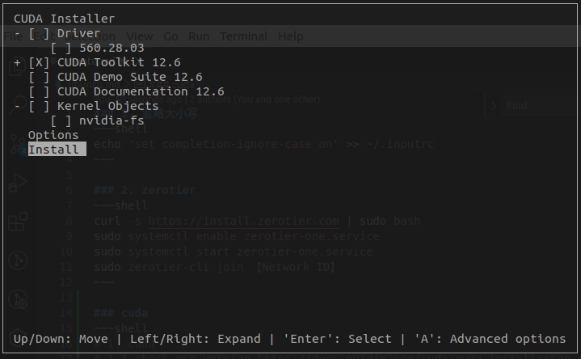

### 1. 忽略大小写
~~~shell
echo 'set completion-ignore-case on' >> ~/.inputrc
~~~

### 2. zerotier
~~~shell
curl -s https://install.zerotier.com | sudo bash
sudo systemctl enable zerotier-one.service
sudo systemctl start zerotier-one.service
sudo zerotier-cli join 【Network ID】
~~~

### 3. common application
~~~shell
sudo apt update
sudo apt install -y git curl wget vim tmux htop net-tools openssh-server terminator guake aria2
~~~

### 4. python3.12
~~~shell
sudo add-apt-repository ppa:deadsnakes/ppa
sudo apt update
sudo apt install python3.12
python3.12 --version
# install pip
curl -sS https://bootstrap.pypa.io/get-pip.py | python3.12
# install pipenv
python3.12 -m pip install --user pipenv
# export PATH=$PATH:$HOME/.local/bin >> ~/.bashrc
# source ~/.bashrc
pipenv --version
# install env in project
export PIPENV_VENV_IN_PROJECT=1 >> ~/.bashrc
source ~/.bashrc
pipenv install --python /usr/bin/python3.12
# install package
pipenv install <package>
# activate env
pipenv shell
# run script
pipenv run python3.12 <script>
# remove env
pipenv --rm
# check graph
pipenv graph
~~~

### 5. cmake && gcc
~~~shell
sudo apt show cmake
sudo apt install cmake
cmake --version
# gcc
sudo apt update
sudo apt install software-properties-common
sudo add-apt-repository ppa:ubuntu-toolchain-r/test
sudo apt update
sudo apt install gcc-13 g++-13
# set default gcc
sudo update-alternatives --install /usr/bin/gcc gcc /usr/bin/gcc-13 100
sudo update-alternatives --install /usr/bin/g++ g++ /usr/bin/g++-13 100
gcc --version
~~~

### 6.cuda

~~~shell
# 1. cuda
# 1.1 install driver
# browse https://www.nvidia.cn/geforce/drivers/
chmod +x /path/to/driver
sudo /path/to/driver
# 1.2 install cuda
# browse https://developer.nvidia.com/cuda-downloads?target_os=Linux&target_arch=x86_64&Distribution=Ubuntu&target_version=20.04&target_type=runfile_local
sudo ./cuda_xxx_linux.run
# 1.3 cudnn
# browse https://developer.nvidia.com/cudnn-downloads?target_os=Linux&target_arch=x86_64&Distribution=Ubuntu&target_version=20.04&target_type=deb_local
# edit ~/.bashrc
export CUDA_HOME=/usr/local/cuda
export PATH=$PATH:$CUDA_HOME/bin
export LD_LIBRARY_PATH=$LD_LIBRARY_PATH:$CUDA_HOME/lib64
~~~